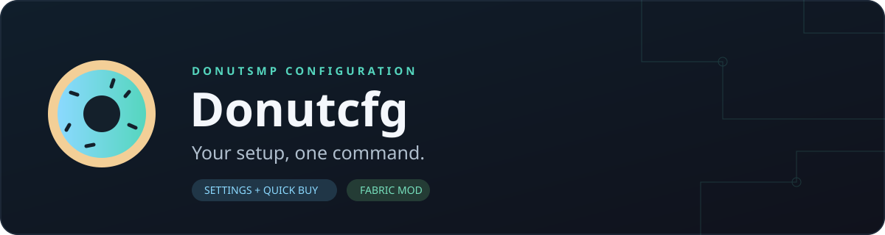

<p align="center">
  
</p>

<p align="center">
  <a href="https://github.com/DarkMaf1a/Donutcfg/releases"></a>
  
  
</p>

<p align="center"><b>Save your DonutSMP setup. Restore it when you need it.</b><br>
Named profiles for <code>/settings</code> and <code>/shop</code> Quick Buy — with selective loading, a built-in preset, and a Cancel button.</p>

<p align="center">This mod was vibecoded with AI.</p>

---

## Download

Choose the build for your actual Minecraft client. Install **only one** Donutcfg JAR.

| Minecraft client | Release | JAR |
| --- | --- | --- |
| **1.21.11** | [Donutcfg 0.5.0 · 1.21.11](https://github.com/DarkMaf1a/Donutcfg/releases/tag/v0.5.0-mc1.21.11) | [Download](https://github.com/DarkMaf1a/Donutcfg/releases/download/v0.5.0-mc1.21.11/donutcfg-0.5.0.jar) |
| **26.2** | [Donutcfg 0.5.0 · 26.2](https://github.com/DarkMaf1a/Donutcfg/releases/tag/v0.5.0-mc26.2) | [Download](https://github.com/DarkMaf1a/Donutcfg/releases/download/v0.5.0-mc26.2/donutcfg-0.5.0%2B26.2.jar) |

> These builds passed local compilation and regression checks. The latest profile/Cancel changes still need live verification against the server GUI. Server-side menu updates can affect compatibility.

## Requirements

| Dependency | Minecraft 1.21.11 build | Minecraft 26.2 build |
| --- | --- | --- |
| [Minecraft Java Edition](https://www.minecraft.net/en-us/download) | 1.21.11 | 26.2 |
| [Fabric Loader](https://fabricmc.net/use/installer/) | 0.18.1 or newer | 0.19.5 or newer |
| [Fabric API](https://modrinth.com/mod/fabric-api/versions) | Version for **1.21.11** | Version for **26.2** |
| [ViaFabricPlus](https://modrinth.com/mod/viafabricplus/versions) | Release for **1.21.11** | Release for **26.2** |
| Java | 21 or newer | 25 or newer |

**Important:** in ViaFabricPlus, select **Minecraft 1.21.5 or below as the server protocol**, then reconnect. This selects the supported DonutSMP menu layout; it does **not** mean you should install the mod on a 1.21.5 client. Choose dependency downloads matching your actual client version, not the translated protocol. ViaFabricPlus is required for this supported server-GUI workflow, even though it is not a hard Fabric dependency in the mod manifest.

## Quick start

1. Install Fabric for your client version.
2. Put Donutcfg, matching Fabric API, and matching ViaFabricPlus into that instance's `mods` folder. Remove older/duplicate Donutcfg JARs first.
3. Start Minecraft, select the ViaFabricPlus protocol described above, and reconnect to DonutSMP.
4. Run `/cfghelp` to see the commands. First launch creates a built-in `default` profile locally.
5. Run `/startcfg all default` to apply its settings and Quick Buy layout, or `/savecfg mysetup` to save your current server setup instead.

Do not click through menus manually while an operation is running. Use **Cancel Donutcfg**, the chat **[Cancel]** link, or `/stopcfg` if you need to interrupt it.

## What it does

| Feature | Behavior |
| --- | --- |
| Named profiles | Save both server menus to local JSON and reuse them later. |
| Select, then start | `/setcfg` selects only. Nothing is applied until you run `/startcfg` or `/loadcfg`. |
| Selective loading | Apply `all`, only `settings`, or only `shop`. |
| Built-in default | 14 settings and a carefully arranged 43-item Quick Buy preset. |
| Profile browser | List names, see the selected profile, and use Tab completion. Clicking a name prepares a command; it does not execute it. |
| Quick Buy cleanup | Clear the editable Quick Buy entries through the server's Edit menu. |
| Cancel controls | Stop saving, loading, or cleaning from the active menu or chat. |
| Safer files | Failed saves preserve the previous profile; deleted profiles have recoverable local backups. |
| Readable feedback | Cyan commands, gold profile names, and distinct success/warning/error colors. |

This is a standalone **client-side Fabric mod**, not a Meteor addon or a farming/combat bot. It automates configuration menus, not purchases or PvP.

## Commands

All commands below are local client commands supplied by Donutcfg.

| Command | Description |
| --- | --- |
| `/cfghelp` · `/cfg help` · `/cfg` | Show help and the selected profile/mode. |
| `/cfglist` | List available profiles; click a name to prepare `/setcfg`. |
| `/setcfg <name>` | Select a profile **without starting**. |
| `/startcfg [all\|settings\|shop] [name]` | Start applying a profile. No arguments uses the selected profile and mode. |
| `/loadcfg [all\|settings\|shop] [name]` | Alias with the same loading behavior. |
| `/cfgmode <all\|settings\|shop>` | Remember a loading mode without starting. |
| `/savecfg [name]` | Save current settings **and** Quick Buy to a personal profile. |
| `/del cfg <name>` · `/delcfg <name>` | Delete a personal profile from the list; keep a backup in `.deleted`. |
| `/cleanshop` · `/cfg clean` | Clear Quick Buy through Edit. |
| `/stopcfg` | Immediately stop all active Donutcfg processes. |

```text
/savecfg mysetup
/setcfg mysetup
/startcfg shop mysetup
/startcfg settings default
/loadcfg all mysetup
```

When specifying a name for `/startcfg` or `/loadcfg`, put the mode first. `/startcfg mysetup` is not supported. Without a name, `/savecfg` uses the selected personal profile, or your Minecraft username if `default` is selected. Use an explicit name to avoid a username-based filename.

**Cancellation stops future actions; it does not undo completed server changes.** It does not submit an open sign or save a pending Edit automatically. You may need to close the remaining screen manually.

## Profiles & the default layout

Files are stored in **`.minecraft/config/donutcfg-configs/`**, inside the instance running the mod. The selected name/mode is stored in `.selection.json`.

`default` is reserved: it cannot be overwritten by `/savecfg` or deleted. An older, different default is backed up as `default-user-N.json` before the built-in preset is regenerated. Personal names can contain 1–48 letters, digits, `_`, or `-`.

The default includes separate Blast Protection and Protection leggings/boots, Fortune and Silk Touch pickaxes, a Breach IV mace, a Riptide III trident, an empty shulker, buckets, and other supplies. See the **[complete default preset](docs/DEFAULT-PRESET.md)** for exact slots, quantities, and enchantments.

The **26.2 build can import schema-1 profiles from 1.21.11**: copy your personal JSON files into the other instance's profile folder. This is one-way compatibility: profiles newly saved with the `26.2` marker are not accepted by the 1.21.11 build. Loading a saved shop layout clears positions that are empty in that profile.

## Troubleshooting

| Problem | What to check |
| --- | --- |
| GUI unavailable/incompatible | Install the ViaFabricPlus build for your client, select server protocol 1.21.5 or below, reconnect, and retry. Also check server permissions and whether `/shop`/`/settings` open manually. |
| Save stops before completion | Read the reason in chat. Old data is preserved. Custom items, filled shulkers, or unsupported enchantments/potions can be rejected instead of saved incorrectly. |
| Search/addition gets stuck | Stop the operation, verify the supported English server GUI, and report the item/screen involved. Server menu changes may require a mod update. |
| A profile is missing | Check the active instance's config folder and `/cfglist`. Names must follow the supported format. |
| Deleted a profile accidentally | Recover its JSON from `donutcfg-configs/.deleted/` and rename it to a supported personal name. |
| Duplicate mod or wrong Java error | Keep one Donutcfg JAR, match the client version, and use the Java version in the requirements table. |

An incompatibility hint is a troubleshooting suggestion, not proof that ViaFabricPlus is missing. Timeouts can also have other causes.

## Source & contributing

| Folder | Target | Development JDK |
| --- | --- | --- |
| [`minecraft-1.21.11`](minecraft-1.21.11) | Yarn-mapped 1.21.11 | 21 |
| [`minecraft-26.2`](minecraft-26.2) | Unobfuscated Mojang-named 26.2 | 25 |

See **[CONTRIBUTING](CONTRIBUTING.md)** for build commands and regression checks, **[CHANGELOG](CHANGELOG.md)** for release notes, and **[the privacy review](docs/PRIVACY.md)** for publication scope and local data handling.

Report reproducible problems in [Issues](https://github.com/DarkMaf1a/Donutcfg/issues). Remove tokens, IP addresses, account details, coordinates, and local user paths from logs before posting them. No recording-tool commands are included in these builds.

---

<p align="center">Made by <a href="https://github.com/DarkMaf1a">DarkMaf1a</a> · Client-side · Fabric<br>
Not an official Minecraft product. Not affiliated with Mojang, Microsoft, or DonutSMP.</p>
